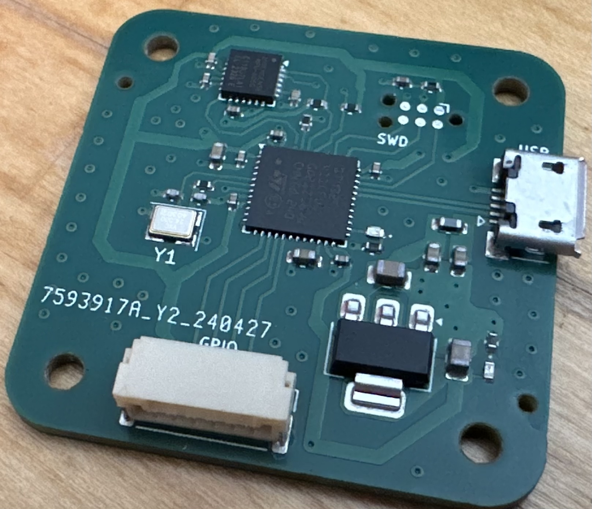

# STM32 Learning Sandbox

Project built from [stm32 template](https://github.com/stm32-rs/stm32f4xx-hal) (rust development for STM32).

My main goal with this project was to learn a little bit about embedded applications. For this project, I used KiCAD to perform the layout & routing (copying the hardware design directly from [Phil's Lab](https://github.com/pms67)) and then used the RTIC framework to begin programming it.

I started with a basic blinky script and then added in functionality to interface with the IMU over I2C. I attempted to write as much of the I2C driver as I could directly from scratch by reading the IMU's datasheet (and later switching to using an existing I2C driver written in rust).